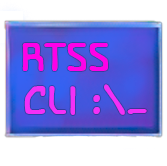

[![Discord][discord-shield]][discord-url]
[![Donalerts][donalerts-shield]][donalerts-url]
[![GPL License][license-shield]][license-url]

<br />
<div align="center">
  <a href="https://github.com/Erruar/RTSS-CLI">
    
  </a>

  <h3 align="center">Saku RTSS CLI</h3>

  <p align="center">
    Now OSD is a simple task!
    <br />
    <a href="https://github.com/Erruar/RTSS-CLI/releases"><strong>Explore the releases »</strong></a>
    <br />  
    <a href="https://github.com/Erruar/RTSS-CLI/issues">Report Bug</a>
    ·
    <a href="https://github.com/Erruar/RTSS-CLI/issues">Request Feature</a>
  </p>
</div>


## About The Project

[![Product Name Screen Shot][product-screenshot]](https://github.com/Erruar/RTSS-CLI/blob/main/Images/HelpWindow.png)

RTSS CLI is a command-line application designed to simplify the process of changing text in the On-Screen Display (OSD) of Riva Tuner Statistics Server (RTSS). The RTSS API is originally written in C++, making it extremely difficult or even impossible to integrate into projects that use other programming languages. This application bridges that gap, enabling developers to easily add support for displaying their metrics during gameplay using RTSS, regardless of their project's programming language.

## Advantages

- **Ease of Use:** Setting custom text in RTSS is simple with this application!
- **Portability:** The app is portable and can be used without any installation.
- **Customization:** You can set the position of your text, its color, and font sizes.
- **One-Command Reset:** Clear or reset the OSD with a single command.
- **Resource Efficient:** After making changes, the application exits, ensuring no more RAM or CPU usage.
- **Language Agnostic:** Easy to integrate into any programming language project.

## Getting Started

### Prerequisites

- Windows Operating System
- Visual Studio with MSVC (Microsoft Visual C++) compiler

**Note:** This project is primarily designed to run on Windows in Visual Studio with MSVC. It will not run in CLion due to differences in compilers.

### Installation

1. Clone the repository:
    ```git clone https://github.com/Erruar/RTSS-CLI.git```
2. Open the project in Visual Studio.
3. Build the solution.

### Usage

Run the application from the command line with the necessary arguments to customize the RTSS OSD. Here are some example commands:
<h1 align="center">Set custom text, position, color</h1>
</img> 
<strong>Set custom text, position, color:</strong>
"Saku RTSS CLI.exe" --text "Your custom text"
<br />
<h1 align="center">Clear OSD</h1>
</img> 
<strong>Clear OSD:</strong>
"Saku RTSS CLI.exe" --reset

# Integration

Integrate the RTSS CLI into your project by invoking the executable with the appropriate arguments from within your code. This makes it easy to add RTSS support to any application, regardless of the programming language used.

## How to integrate it in C#?
You can use the Process start (Process.StartInfo) for .exe but it will be better if you using the .dll import. It will be faster up to 5 times.
To integrate the .dll in your C# app you need:
1. Download the SakuRTSSCLI.dll and put it in main folder of your C# project, like that


2. Right click on it and press ALT+Enter to open file properties menu.


3. Select **Build action: None** and **Copy to output directory: Copy always**
4. Create any class (.cs) file in any project folder or root. Name it whatever you want
5. Set the class code like that:
```cs
public static partial class RTSSHandler
{
    private const string DllName = "SakuRTSSCLI.dll";  //The name of .dll in output directory
    public static void ChangeOSDText(string text) //Use RTSSHandler.ChangeOSDText("Any your Text"); in any class to show "Any your Text" in OSD.
    { 
        displayText(text); 
    }
    public static void ResetOSDText() //Use RTSSHandler.ResetOSDText(); in any class to remove any text by SakuRTSSCLI in OSD.
    {
        _ = ReleaseOSD(); 
    }

    [DllImport(DllName, CallingConvention = CallingConvention.StdCall)]
    public static extern void displayText(string text);

    [DllImport(DllName, CallingConvention = CallingConvention.StdCall)]
    public static extern int Refresh();

    [DllImport(DllName, CallingConvention = CallingConvention.StdCall)]
    public static extern uint EmbedGraph(uint dwOffset, float[] lpBuffer, uint dwBufferPos, uint dwBufferSize, int dwWidth, int dwHeight, int dwMargin, float fltMin, float fltMax, uint dwFlags);

    [DllImport(DllName, CallingConvention = CallingConvention.StdCall)]
    public static extern uint GetClientsNum();

    [DllImport(DllName, CallingConvention = CallingConvention.StdCall)]
    public static extern uint GetSharedMemoryVersion();

    [DllImport(DllName, CallingConvention = CallingConvention.StdCall)]
    public static extern bool UpdateOSD(string lpText);

    [DllImport(DllName, CallingConvention = CallingConvention.StdCall)]
    public static extern int ReleaseOSD(); 
}
```

## How to integrate it in Python?
```py
import ctypes
from ctypes import c_uint, c_int, c_bool, c_float, c_char_p, POINTER

# Loading DLL
dll = ctypes.CDLL('SakuRTSSCLI.dll') 

dll.displayText.argtypes = [c_char_p]
dll.displayText.restype = None

dll.Refresh.argtypes = []
dll.Refresh.restype = c_int

dll.EmbedGraph.argtypes = [c_uint, POINTER(c_float), c_uint, c_uint, c_int, c_int, c_int, c_float, c_float, c_uint]
dll.EmbedGraph.restype = c_uint

dll.GetClientsNum.argtypes = []
dll.GetClientsNum.restype = c_uint

dll.GetSharedMemoryVersion.argtypes = []
dll.GetSharedMemoryVersion.restype = c_uint

dll.UpdateOSD.argtypes = [c_char_p]
dll.UpdateOSD.restype = c_bool

dll.ReleaseOSD.argtypes = []
dll.ReleaseOSD.restype = c_int 

# Defining all functions
def change_osd_text(text):
    dll.displayText(text.encode('utf-8'))

def reset_osd_text():
    dll.ReleaseOSD()

def refresh():
    return dll.Refresh()

def embed_graph(dw_offset, buffer, dw_buffer_pos, dw_buffer_size, dw_width, dw_height, dw_margin, flt_min, flt_max, dw_flags):
    float_array_type = c_float * len(buffer)
    lp_buffer = float_array_type(*buffer)
    return dll.EmbedGraph(dw_offset, lp_buffer, dw_buffer_pos, dw_buffer_size, dw_width, dw_height, dw_margin, flt_min, flt_max, dw_flags)

def get_clients_num():
    return dll.GetClientsNum()

def get_shared_memory_version():
    return dll.GetSharedMemoryVersion()

def update_osd(text):
    return dll.UpdateOSD(text.encode('utf-8'))

def release_osd():
    return dll.ReleaseOSD()

# EXAMPLES
if __name__ == "__main__":
    change_osd_text("Any your Text")
    reset_osd_text() 
```
**Make sure** that SakuRTSSCLI.dll **IN FOLDER** WITH PYTHON FILE!

### License

This project is licensed under the GPL-3 License. See the [LICENSE](LICENSE) file for details.

## Contributing

Contributions are welcome! 

## Acknowledgements

Special thanks to the developers of Riva Tuner Statistics Server for providing a robust API for OSD.
If you have a suggestion that would make this better, please fork the repo and create a pull request. You can also simply open an issue with the tag "enhancement".
Don't forget to give the project a star! Thanks again!

1. [Fork the Project](https://github.com/Erruar/RTSS-CLI/fork)
2. Create your Feature Branch 
3. Commit your Changes in your fork
4. Push to the Branch 
5. [Open a Pull Request](https://github.com/Erruar/RTSS-CLI/pulls)
6. Wait for acceptiong or rejecting!
---

Feel free to copy, modify, and distribute this project in accordance with the terms of the license. Enjoy using RTSS CLI for all your OSD customization needs!

[product-screenshot]: https://github.com/Erruar/RTSS-CLI/blob/main/Images/HelpWindow.png
[discord-shield]: https://img.shields.io/badge/Join%20our-discord-%23ff7f50?style=for-the-badge&logo=discord&logoColor=%23ff7f50
[discord-url]: https://discord.gg/WzgsFvgTuh
[donalerts-shield]: https://img.shields.io/badge/Support%20me-DonAlerts-%23f13a13?style=for-the-badge&logo=disqus&logoColor=%23f13a13
[donalerts-url]: https://www.donationalerts.com/r/RubyTrack
[license-shield]: https://img.shields.io/badge/LICENSE%20-GPL-%230ff99C?style=for-the-badge
[license-url]: https://github.com/Erruar/RTSS-CLI/blob/main/LICENSE.md
